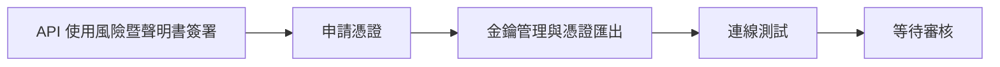
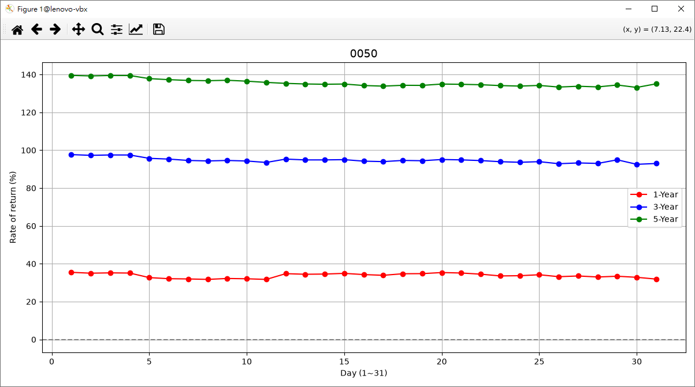
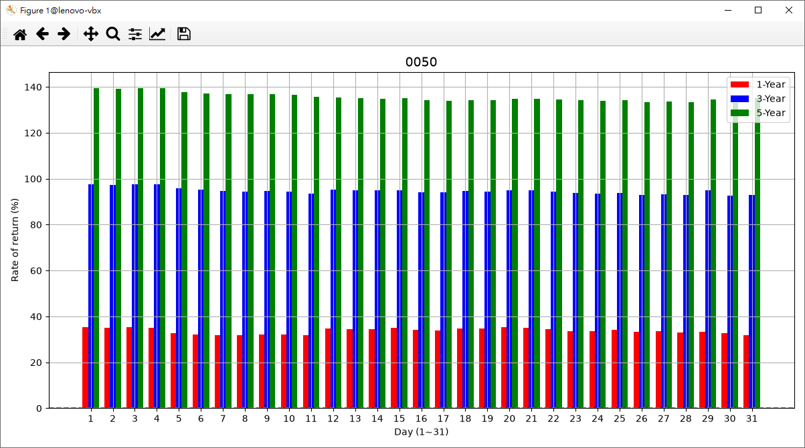

# 證劵交易 API

# 1. Overview

> 主要是透過證劵商提供的交易 API 進行交易，來讓個人的交易更加靈活，

>目前很多證劵商提供相關的交易 API，雖然目的都是操作股票交易，但是還是會存在些許的差異。
>
>文件往往是成敗的關鍵，人的一生能浪費多少時間在這些文件裏，於是想透過再次包裝，提供簡單化的介面，造福大眾。

# 2. Depend on

## - [pythonP9](https://github.com/lankahsu520/pythonP9)

```bash
$ pip install git+https://github.com/lankahsu520/pythonP9.git
```

## - [玉山證劵交易 API](https://www.esunsec.com.tw/trading-platforms/api-trading/)


#### A. 申請使用交易 API 服務
>  [事前準備](https://www.esunsec.com.tw/trading-platforms/api-trading/docs/prerequisites)


#### B. [安裝套件](https://www.esunsec.com.tw/trading-platforms/api-trading/docs/prerequisites/#安裝套件)

```bash
$ pip install esun_trade-2.2.0-cp37-abi3-manylinux_2_17_x86_64.manylinux2014_x86_64.whl

# 新增 close_websocket
$ vi ~/.local/lib/python3.12/site-packages/esun_trade/websocket.py
    def close_websocket(self):
        self.__ws.close()
        self.__ws = None
# 新增 close_websocket
$ vi ~/.local/lib/python3.12/site-packages/esun_trade/sdk.py
    def close_websocket(self):
        self.__wsHandler.close_websocket()
```

#### C. 進行模擬測試

> [API 模擬金鑰](https://esuntradingapi.esunsec.com.tw/keys/apikey/SimulationAPIKeyManagement)
>
> 取得 config.simulation.ini (設定檔) & XXXXXXXXXX_XXXXXXXX.p12 (憑證)

> [完成模擬下單](https://www.esunsec.com.tw/trading-platforms/api-trading/docs/prerequisites#完成模擬下單)


#### D. 取得正式金鑰

> [API 正式金鑰](https://esuntradingapi.esunsec.com.tw/keys/apikey/APIKeyManagement)
>
> 取得 config.ini (設定檔) & XXXXXXXXXX_XXXXXXXX.p12 (憑證)


#### E. 進行正式交易

> 取得正式金鑰後，就可以用原本的程式進行交易或是查詢，請參考[完成模擬下單](https://www.esunsec.com.tw/trading-platforms/api-trading/docs/prerequisites/#完成模擬下單)。

## ~~- 國泰證劵（20260915 目前沒有提供）~~

## - [富邦新一代 API](https://www.fbs.com.tw/TradeAPI/)



#### A. API 使用風險暨聲明書簽署

> 依照下方說明連結分別進行API 聲明書簽署、API 連線測試 [線上簽署SOP說明書](https://www.fbs.com.tw/wcm/new_web/operate_manual/operate_manual_01/API-SignSOP_guide.pdf)

> [富邦證券首頁](https://www.fbs.com.tw/CustomerService/Index) -> 客戶服務 - e 櫃台 -> 簽署中心 - 2-1 線上簽署 -> 02 應用程式介面(API)服務申請書暨聲明書

#### B. [申請憑證](https://www.fbs.com.tw/TradeAPI/docs/trading/prepare/#申請憑證)

#### C. [金鑰管理與憑證匯出](https://www.fbs.com.tw/TradeAPI/docs/key/)

> 取得 API Key & XXXXXXXXXX_XXXXXXXX.p12 (憑證)

```ini
#這邊採用玉山證劵的方式，建立 config.ini；把帳密和程式分開放
$ vi /work/certs/fubon/config.ini
[Cert]
Path = /work/certs/fubon/XXXXXXXXXX_XXXXXXXX.p12
[Api]
Secret = FFFFFFFFFFFFFFFFFFFFFFFFFFFFFFFFFFFFFFFFFFFFFFFFFFFFFFFFFFFFFFFF
[User]
Account = XXXXXXXXXX
```

##### C1. 登入方式與 API Key

> 您仍可使用現有的**交易帳號密碼及憑證**登入並使用 API。
>
> **API Key 是一個選擇性功能**，提供更高的安全性與靈活性，適合有進階需求的使用者。 [了解為什麼選擇 API Key →](https://www.fbs.com.tw/TradeAPI/docs/key/#為什麼選擇-api-key)

#### D. [連線測試](https://www.fbs.com.tw/TradeAPI/docs/trading/prepare/#連線測試)

> 下載使用連線測試程式 (for Windows), 或直接使用新一代 API 進行連線登入 [連線測試小幫手](https://www.fbs.com.tw/TradeAPI_SDK/sample_code/API_Sign_Test.zip)

#### E. [SDK 下載](https://www.fbs.com.tw/TradeAPI/docs/download/download-sdk/)並安裝

> 請先閱讀[安裝與版本相容性](https://www.fbs.com.tw/TradeAPI/docs/install-compatibility/)以確認各語言最低版本與安裝方式，並至[SDK 下載](https://www.fbs.com.tw/TradeAPI/docs/download/download-sdk)取得安裝檔。

```bash
$ pip install fubon_neo-2.3.0-cp37-abi3-manylinux_2_17_x86_64.manylinux2014_x86_64.whl

$ vi ~/.local/lib/python3.12/site-packages/fubon_neo/sdk.py
```

# 3. Current Status

## 3.1. 玉山證劵

> 玉山證劵 API 算是簡單易懂。
>
> 回傳都是用 json format。

## ~~3.2. 國泰證劵（20260915 目前沒有提供）~~

## 3.3. 富邦證劵

> 文件說明太過複雜。就舉版本支援說明，能直接點明測試的版本，然後建議以上版本就行。另外回傳都是用 <class 'builtins.CustomReturnType'> 這部分請注意。

> 富邦證劵提供的功能比較多，不過這邊只接上幾個常用的來操作；如果有特別需要的，可以參照其它程式碼繼續增加。

# 4. Build

# 5. Example or Usage

## - backtesting_123.py - 利用股票的收盤價計算每月存股的報酬率

> 先從`臺灣證券交易所/證券櫃檯買賣中心`取得歷史收盤價，計算`日日存`的報酬率

> 分割計算
>
> ```python
> # backtesting_api.py
> 
> stock_splits = [ ("0050", pd.Timestamp("2025-06-18"), 1/4) ]
> ```

> 短、中、長期報酬率設定
>
> ```python
> # backtesting_123.py
> 
> argsX = {
> 	"stock_no": stock_no
> 	,"year_ago": year_ago
> 	,"delta": delta_days
> 	,"buy_short": 1
> 	,"buy_medium": 3
> 	,"buy_long": 5
> 	,"history_folder": f"./stock"
> 	,"renew": False
> 	,"text": False
> 	,"verbose": False
> }
> ```
>
> ```python
> # backtesting_api.py
> 
> 	def parse_args(self, args):
> 		...
> 		self.buy_short = args["buy_short"]
> 		self.buy_medium = args["buy_medium"]
> 		self.buy_long = args["buy_long"]
> ```

```bash
$ ./backtesting_123.py
Usage: ./backtesting_123.py <options...>
  -h, --help
  -d, --debug level
  -s, --stock Stock symbol
  -y, --year N years ago
  -l, --delta N days ago
  -r, --renew
  -t, --text
  -v, --verbose
    0: critical, 1: errror, 2: warning, 3: info, 4: debug, 5: trace
```

```bash
$ make backtesting_123
or
$ ./backtesting_123.py -d4 -y 10 -s 0050
[8540/140536377751360] pythonP9.py|argsX_dump:0057 - {'stock_no': '0050', 'year_ago': 10, 'delta': 5, 'buy_short': 1, 'buy_medium': 3, 'buy_long': 5, 'history_folder': './stock', 'renew': False, 'text': False, 'verbose': False}
[8540/140536377751360] backtesting_api.py|history_load_from_csv:0329 - Found !!! (./stock/0050_history.csv), Loading ...
[0050] (stock_last_date：2026-09-09, delta.days: 2, stock_delta_days: 5)  Completed !!!
Day 1-Year                  3-Year                  5-Year                  Sum
    (%)    count  average   (%)    count  average   (%)    count  average   (%)
1   35.47  12     80.94     97.68  36     55.47     139.53 60     45.78     272.68
2   35.02  12     81.21     97.29  36     55.58     139.26 60     45.83     271.57
3   35.19  12     81.11     97.49  36     55.52     139.48 60     45.79     272.16
4   35.09  12     81.17     97.47  36     55.53     139.46 60     45.79     272.02
5   32.69  12     82.63     95.71  36     56.03     137.84 60     46.10     266.24
6   32.11  12     83.00     95.31  36     56.14     137.28 60     46.21     264.70
7   31.98  12     83.08     94.59  36     56.35     136.87 60     46.29     263.44
8   31.74  12     83.23     94.33  36     56.42     136.73 60     46.32     262.80
9   32.23  12     82.92     94.58  36     56.35     136.95 60     46.27     263.76
10  32.07  12     83.03     94.3   36     56.43     136.48 60     46.37     262.85
11  31.73  12     83.24     93.53  36     56.66     135.83 60     46.50     261.09
12  34.77  13     81.36     95.31  37     56.14     135.32 60     46.60     265.40
13  34.45  13     81.55     94.87  37     56.27     135.0  60     46.66     264.32
14  34.56  13     81.49     94.88  37     56.27     134.85 60     46.69     264.29
15  34.92  13     81.27     95.01  37     56.23     134.97 60     46.66     264.90
16  34.29  13     81.65     94.22  37     56.46     134.18 60     46.82     262.69
17  33.9   13     81.89     93.97  37     56.53     133.86 60     46.89     261.73
18  34.72  13     81.39     94.6   37     56.35     134.3  60     46.80     263.62
19  34.78  13     81.35     94.44  37     56.39     134.25 60     46.81     263.47
20  35.36  13     81.00     95.09  37     56.21     134.96 60     46.67     265.41
21  35.11  13     81.15     94.89  37     56.26     134.82 60     46.70     264.82
22  34.5   13     81.52     94.52  37     56.37     134.6  60     46.74     263.62
23  33.57  13     82.09     93.93  37     56.54     134.15 60     46.83     261.65
24  33.69  13     82.02     93.62  37     56.63     133.88 60     46.88     261.19
25  34.2   13     81.70     93.95  37     56.53     134.23 60     46.81     262.38
26  33.17  13     82.34     92.86  37     56.85     133.37 60     46.99     259.40
27  33.55  13     82.10     93.28  37     56.73     133.8  60     46.90     260.63
28  33.01  13     82.44     93.02  37     56.81     133.45 60     46.97     259.48
29  33.41  12     82.19     94.92  35     56.25     134.45 56     46.77     262.78
30  32.84  12     82.54     92.55  34     56.95     133.17 55     47.03     258.56
31  31.9   7      83.13     92.98  21     56.82     135.08 35     46.64     259.96
(stock_no: 0050, final_price: 109.65)
[8540/140536377751360] backtesting_api.py|buy_return_plot_lines_on_screen:0244 - Plotting lines ...

```





## - esun_sample.py - 玉山證劵模擬交易範例

> 這是官方的交易範例

## - esunp9_123.py - 玉山證劵交易範例

> -t : 單純測式流程，不會下單 

```bash
$ make esunp9_123
# or
$ ./esunp9_123.py
[9870/9870] pythonP9.py|argsX_dump:0057 - {'securities_firm': 'ESun', 'config_ini': '/work/certs/esun/config.ini', 'verbose': True, 'test_only': False, 'intact_json': False}

--------------- ESun 主選單 ---------------
  [1] 庫存明細,
  [2] 交易下單,
  [3] 委託紀錄, [4] 成交明細, [5] 委託刪單,
  [6] 交割款, [7] 銀行餘額, [8] 交易額度,
  [i] 資料切換 (Partial),
  [l] logout
請輸入編號 [1]~[8], [q] 離開：8
[9870/9870] esunp9.py|tradex_q_tradelimit:0695 - {"trade_limit": 1000000, "margin_limit": 0, "short_limit": 0, "day_trade_code": "X", "margin_code": "9", "short_code": "9"}

--------------- ESun 主選單 ---------------
  [1] 庫存明細,
  [2] 交易下單,
  [3] 委託紀錄, [4] 成交明細, [5] 委託刪單,
  [6] 交割款, [7] 銀行餘額, [8] 交易額度,
  [i] 資料切換 (Partial),
  [l] logout
請輸入編號 [1]~[8], [q] 離開：q
[9870/9871] esunp9.py|on_close:0848 - (close_status_code: None, close_msg: None)
[9870/9871] esunp9.py|threadx_handler:0870 - Bye-Bye !!!
[9870/9870] esunp9_123.py|main:0378 - Bye-Bye !!! (app_quit_get: 1)
```

## - fubonp9_123.py - 富邦證劵交易範例

> -t : 單純測式流程，不會下單 

```bash
$ make fubonp9_123
# or
$ ./fubonp9_123.py
[12585/12585] pythonP9.py|argsX_dump:0057 - {'securities_firm': 'Fubon', 'config_ini': '/work/certs/fubon/config.ini', 'verbose': True, 'test_only': False, 'intact_json': False}
[12585/12591] fubonp9.py|on_event:0950 - (code: 100, content: connected)
[12585/12591] fubonp9.py|on_event:0950 - (code: 200, content: logged in)

--------------- Fubon 主選單 ---------------
  [1] 庫存明細,
  [2] 交易下單,
  [3] 委託紀錄, [4] 成交明細, [5] 委託刪單,
  [6] 交割款, [7] 銀行餘額, [8] 交易額度,
  [i] 資料切換 (Partial),
  [l] logout
請輸入編號 [1]~[8], [q] 離開：8
[12585/12585] fubonp9.py|tradex_q_tradelimit:0727 - (tradelimit: 未提供相關 API !!!)

--------------- Fubon 主選單 ---------------
  [1] 庫存明細,
  [2] 交易下單,
  [3] 委託紀錄, [4] 成交明細, [5] 委託刪單,
  [6] 交割款, [7] 銀行餘額, [8] 交易額度,
  [i] 資料切換 (Partial),
  [l] logout
請輸入編號 [1]~[8], [q] 離開：q
[12585/12592] fubonp9.py|threadx_handler:0929 - Bye-Bye !!!
[12585/12585] fubonp9_123.py|main:0378 - Bye-Bye !!! (app_quit_get: 1)
```

# 6. Documentation

## 6.1. 帳號

```bash
$ mkdir -p ~/.config/python_keyring
# 如果不要存密碼
$ vi ~/.config/python_keyring/keyringrc.cfg
[backend]
# 如果不要存密碼
default-keyring=keyring.backends.null.Keyring
# 如果要存密碼，請改用下面
#default-keyring=keyrings.alt.file.PlaintextKeyring
```

```bash
$ cat ~/.local/share/python_keyring/keyring_pass.cfg

# 清掉原本的 keyring 資料
$ rm -f ~/.local/share/python_keyring/keyring_pass.cfg
```

### 6.2.1. 登入

| 名稱           | 描述     |
| -------------- | -------- |
| tradex_login() | 登入帳號 |

| 證劵商 | API                                                          | 描述     |
| ------ | ------------------------------------------------------------ | -------- |
| 玉山   | [login()](https://www.esunsec.com.tw/trading-platforms/api-trading/docs/trading/reference/python#登入-login) | 登入帳號 |
| 國泰   | 無                                                           |          |
| 富邦   | [login(personal_id, password, cert_path, cert_pass)](https://www.fbs.com.tw/TradeAPI/docs/trading/library/python/login/loginPassword) | 登入帳號 |

- #### Input

> None

- #### Response

| 證劵商 | 描述                                                         |
| ------ | ------------------------------------------------------------ |
| 玉山   |                                                              |
| 國泰   |                                                              |
| 富邦   | [Result](https://www.fbs.com.tw/TradeAPI/docs/trading/library/python/login/loginPassword/#result-回傳) |

### 6.2.2. 登出

| 名稱            | 描述     |
| --------------- | -------- |
| tradex_logout() | 登出帳號 |

| 證劵商 | API                                                          | 描述     |
| ------ | ------------------------------------------------------------ | -------- |
| 玉山   | logout()                                                     | 登出帳號 |
| 國泰   | 無                                                           |          |
| 富邦   | [logout()](https://www.fbs.com.tw/TradeAPI/docs/trading/library/python/logout) | 登出帳號 |

- #### Input

> None

- #### Response

| 證劵商 | 描述 |
| ------ | ---- |
| 玉山   |      |
| 國泰   |      |
| 富邦   |      |

### 6.2.3. 重設密碼

| 名稱              | 描述     |
| ----------------- | -------- |
| tradex_password() | 重設密碼 |

| 證劵商 | API                                                          | 描述                                                         |
| ------ | ------------------------------------------------------------ | ------------------------------------------------------------ |
| 玉山   | [reset_password()](https://www.esunsec.com.tw/trading-platforms/api-trading/docs/trading/reference/python#重設密碼-reset_password) | 程式執行到此函數時，會於命令列提示請用戶輸入證券密碼及憑證密碼。 |
| 國泰   | 無                                                           |                                                              |
| 富邦   | 無                                                           |                                                              |

- #### Input

> None

- #### Response

> None

### 6.2.4. 憑證資訊

| 名稱                | 描述     |
| ------------------- | -------- |
| tradex_q_certinfo() | 憑證資訊 |

| 證劵商 | API                                                          | 描述               |
| ------ | ------------------------------------------------------------ | ------------------ |
| 玉山   | [certinfo()](https://www.esunsec.com.tw/trading-platforms/api-trading/docs/trading/reference/python#憑證資訊-certinfo) | 取得憑證相關資訊。 |
| 國泰   | 無                                                           |                    |
| 富邦   | 無                                                           |                    |

- #### Input

> None

- #### Response

> 請見 [certinfo()](https://www.esunsec.com.tw/trading-platforms/api-trading/docs/trading/reference/python#憑證資訊-certinfo)

### 6.2.5. 金鑰資訊

| 名稱              | 描述     |
| ----------------- | -------- |
| tradex_q_apiKey() | 金鑰資訊 |

| 證劵商 | API                                                          | 描述               |
| ------ | ------------------------------------------------------------ | ------------------ |
| 玉山   | [get_key_info()](https://www.esunsec.com.tw/trading-platforms/api-trading/docs/trading/reference/python#金鑰資訊-get_key_info) | 取得金鑰相關資訊。 |
| 國泰   | 無                                                           |                    |
| 富邦   | 無                                                           |                    |

- #### Input

> None

- #### Response

> 請見 [get_key_info()](https://www.esunsec.com.tw/trading-platforms/api-trading/docs/trading/reference/python#金鑰資訊-get_key_info)

## 6.2. 查詢

### 6.2.1. 交易額度及權限

| 名稱                  | 描述           |
| --------------------- | -------------- |
| tradex_q_tradelimit() | 交易額度及權限 |

| 證劵商 | API                                                          | 描述                                 |
| ------ | ------------------------------------------------------------ | ------------------------------------ |
| 玉山   | [get_trade_status](https://www.esunsec.com.tw/trading-platforms/api-trading/docs/trading/reference/python/#交易額度及權限-get_trade_status) | 取得用戶交易額度、交易權限相關資訊。 |
| 國泰   | 無                                                           |                                      |
| 富邦   | 無                                                           |                                      |

- #### Input

> None

- #### Response

| 證劵商 | 描述                                                         |
| ------ | ------------------------------------------------------------ |
| 玉山   | [Response](https://www.esunsec.com.tw/trading-platforms/api-trading/docs/trading/reference/python/#response-example-4) |
| 國泰   |                                                              |
| 富邦   |                                                              |

### 6.2.2. 銀行餘額

| 名稱               | 描述     |
| ------------------ | -------- |
| tradex_q_balance() | 銀行餘額 |

| 證劵商 | API                                                          | 描述                                           |
| ------ | ------------------------------------------------------------ | ---------------------------------------------- |
| 玉山   | [get_balance()](https://www.esunsec.com.tw/trading-platforms/api-trading/docs/trading/reference/python#銀行餘額-get_balance) | 取得銀行餘額相關資訊。 (每 180 秒可查詢一次)。 |
| 國泰   | 無                                                           |                                                |
| 富邦   | [accounting.bank_remain(account)](https://www.fbs.com.tw/TradeAPI/docs/trading/library/python/accountManagement/Balance) | 銀行餘額查詢。                                 |

- #### Input

> None

- #### Response

| 證劵商 | 描述                                                         |
| ------ | ------------------------------------------------------------ |
| 玉山   | [Response](https://www.esunsec.com.tw/trading-platforms/api-trading/docs/trading/reference/python/#response-example-15) |
| 國泰   |                                                              |
| 富邦   | [Result](https://www.fbs.com.tw/TradeAPI/docs/trading/library/python/accountManagement/Balance#result-回傳) |

### 6.2.3. 庫存明細

| 名稱                   | 描述     |
| ---------------------- | -------- |
| tradex_q_inventories() | 庫存明細 |

| 證劵商 | API                                                          | 描述                 |
| ------ | ------------------------------------------------------------ | -------------------- |
| 玉山   | [get_inventories()](https://www.esunsec.com.tw/trading-platforms/api-trading/docs/trading/reference/python#庫存明細-get_inventories) | 取得當下的庫存明細。 |
| 國泰   | 無                                                           |                      |
| 富邦   | [accounting.inventories(account)](https://www.fbs.com.tw/TradeAPI/docs/trading/library/python/accountManagement/Inventories) | 庫存查詢。           |

- #### Input

> None

- #### Response

| 證劵商 | 描述                                                         |
| ------ | ------------------------------------------------------------ |
| 玉山   | [Response](https://www.esunsec.com.tw/trading-platforms/api-trading/docs/trading/reference/python/#response-example-14) |
| 國泰   |                                                              |
| 富邦   | [Result](https://www.fbs.com.tw/TradeAPI/docs/trading/library/python/accountManagement/Inventories#result-回傳) |

## 6.3. 交易下單

### 6.3.1. 買進

> 簡化參數，
>
> PriceType: Limit 限價
>
> TimeInForce: ROD 當日委託有效單
>
> OrderType: Stock 現股

| 名稱                                               | 描述            |
| -------------------------------------------------- | --------------- |
| tradex_o_buy(stock_no,  price, quantity)           | 整張買進        |
| tradex_o_buy_after(stock_no,  price, quantity)     | 整張買進 - 盤後 |
| tradex_o_buy_odd(stock_no,  price, quantity)       | 零股買進        |
| tradex_o_buy_odd_after(stock_no,  price, quantity) | 零股買進 - 盤後 |

| 證劵商 | API                                                          | 描述         |
| ------ | :----------------------------------------------------------- | ------------ |
| 玉山   | [place_order(order_object)](https://www.esunsec.com.tw/trading-platforms/api-trading/docs/trading/reference/python#下單-place_orderorder_object) | 送出委託單。 |
| 國泰   | 無                                                           |              |
| 富邦   | [stock.place_order(account, order_object)](https://www.fbs.com.tw/TradeAPI/docs/trading/library/python/trade/PlaceOrder) | 建立委託單。 |

- ####  Input

| 名稱     | 型態   | 描述                                          |
| -------- | ------ | --------------------------------------------- |
| stock_no | string | 股票代號                                      |
| price    | float  | 委託價格 (採用限價, 當日有效 ROD Rest of Day) |
| quantity | int    | 委託數量                                      |

- #### Response

| 證劵商 | 描述                                                         |
| ------ | ------------------------------------------------------------ |
| 玉山   | [Response](https://www.esunsec.com.tw/trading-platforms/api-trading/docs/trading/reference/python/#response-example-5) |
| 國泰   |                                                              |
| 富邦   | [Result](https://www.fbs.com.tw/TradeAPI/docs/trading/library/python/trade/PlaceOrder#result-回傳) |

### 6.3.2. 賣出

| 名稱                                                | 描述            |
| --------------------------------------------------- | --------------- |
| tradex_o_sell(stock_no,  price, quantity)           | 整張賣出        |
| tradex_o_sell_after(stock_no,  price, quantity)     | 整張賣出 - 盤後 |
| tradex_o_sell_odd(stock_no,  price, quantity)       | 零股賣出        |
| tradex_o_sell_odd_after(stock_no,  price, quantity) | 零股賣出 - 盤後 |

| 證劵商 | API                                                          | 描述         |
| ------ | ------------------------------------------------------------ | ------------ |
| 玉山   | [place_order(order_object)](https://www.esunsec.com.tw/trading-platforms/api-trading/docs/trading/reference/python#下單-place_orderorder_object) | 送出委託單。 |
| 國泰   | 無                                                           |              |
| 富邦   | [stock.place_order(account, order_object)](https://www.fbs.com.tw/TradeAPI/docs/trading/library/python/trade/PlaceOrder) | 建立委託單。 |

- ##### Input

| 名稱     | 型態   | 描述                                          |
| -------- | ------ | --------------------------------------------- |
| stock_no | string | 股票代號                                      |
| price    | float  | 委託價格 (採用限價, 當日有效 ROD Rest of Day) |
| quantity | int    | 委託數量                                      |

- #### Response

| 證劵商 | 描述                                                         |
| ------ | ------------------------------------------------------------ |
| 玉山   | [Response](https://www.esunsec.com.tw/trading-platforms/api-trading/docs/trading/reference/python/#response-example-5) |
| 國泰   |                                                              |
| 富邦   | [Result](https://www.fbs.com.tw/TradeAPI/docs/trading/library/python/trade/PlaceOrder#result-回傳) |

### 6.3.3. 委託紀錄

| 名稱              | 描述     |
| ----------------- | -------- |
| tradex_q_orders() | 委託紀錄 |

| 證劵商 | API                                                          | 描述             |
| ------ | ------------------------------------------------------------ | ---------------- |
| 玉山   | [get_order_results()](https://www.esunsec.com.tw/trading-platforms/api-trading/docs/trading/reference/python#委託紀錄-get_order_results) | 取得委託列表。   |
| 國泰   | 無                                                           |                  |
| 富邦   | [stock.get_order_results(accounts)](https://www.fbs.com.tw/TradeAPI/docs/trading/library/python/trade/GetOrderResults) | 取得委託單結果。 |

- ##### Input

> None

- #### Response

| 證劵商 | 描述                                                         |
| ------ | ------------------------------------------------------------ |
| 玉山   | [Response](https://www.esunsec.com.tw/trading-platforms/api-trading/docs/trading/reference/python/#response-example-8) |
| 國泰   |                                                              |
| 富邦   | [Result](https://www.fbs.com.tw/TradeAPI/docs/trading/library/python/trade/GetOrderResults#result-回傳) |

### 6.3.4. 委託歷史紀錄

> 預設最近前 2日的歷史紀錄

| 名稱                                                         | 描述         |
| ------------------------------------------------------------ | ------------ |
| tradex_q_orders_history(start_date_str=None, end_date_str=None) | 委託歷史紀錄 |

| 證劵商 | API                                                          | 描述                                                         |
| ------ | ------------------------------------------------------------ | ------------------------------------------------------------ |
| 玉山   | [get_order_results_by_date(start_date, end_date)](https://www.esunsec.com.tw/trading-platforms/api-trading/docs/trading/reference/python#歷史委託-get_order_results_by_datestart_date-end_date) | 取得 start_date, end_date 時間範圍內的歷史委託列表，無法查詢已刪除及預約單。 |
| 國泰   | 無                                                           |                                                              |
| 富邦   | [stock.order_history(account, start_date, start_date)](https://www.fbs.com.tw/TradeAPI/docs/trading/library/python/trade/OrderHistory) | 查詢歷史委託。                                               |

- ##### Input

| 名稱           | 型態   | 描述                         |
| -------------- | ------ | ---------------------------- |
| start_date_str | string | 格式為 yyyy-MM-dd 的開始日期 |
| end_date_str   | string | 格式為 yyyy-MM-dd 的結束日期 |

- #### Response

| 證劵商 | 描述                                                         |
| ------ | ------------------------------------------------------------ |
| 玉山   | [Response](https://www.esunsec.com.tw/trading-platforms/api-trading/docs/trading/reference/python/#response-example-9) |
| 國泰   |                                                              |
| 富邦   | [Result](https://www.fbs.com.tw/TradeAPI/docs/trading/library/python/trade/OrderHistory#result-回傳) |

### ~~6.3.5. 委託改價~~

> 因為限制過多，暫不包裝此功能。

| 名稱 | 描述 |
| ---- | ---- |
|      |      |

| 證劵商 | API                                                          | 描述           |
| ------ | ------------------------------------------------------------ | -------------- |
| 玉山   | [modify_price(order_result, target_price, price_flag)](https://www.esunsec.com.tw/trading-platforms/api-trading/docs/trading/reference/python#改價-modify_priceorder_result-target_price-price_flag) | 修改委託價格。 |
| 國泰   | 無                                                           |                |
| 富邦   | [stock.modify_price(account, modify_price_obj)](https://www.fbs.com.tw/TradeAPI/docs/trading/library/python/trade/ModifyPrice) | 修改委託價格。 |

- ##### Input

| 名稱 | 型態 | 描述 |
| ---- | ---- | ---- |
|      |      |      |

- #### Response

| 證劵商 | 描述                                                         |
| ------ | ------------------------------------------------------------ |
| 玉山   | [Response](https://www.esunsec.com.tw/trading-platforms/api-trading/docs/trading/reference/python/#response-example-6) |
| 國泰   |                                                              |
| 富邦   | [Result](https://www.fbs.com.tw/TradeAPI/docs/trading/library/python/trade/ModifyPrice#result-回傳) |

### 6.3.6. 委託刪單

> 只能刪除單筆委託

| 名稱                                         | 描述         |
| -------------------------------------------- | ------------ |
| tradex_o_delete(order_result)                | 刪除單筆委託 |
| tradex_o_delete_qty(order_result, qty_share) | 減少委託單量 |

| 證劵商 | API                                                          | 描述                           |
| ------ | ------------------------------------------------------------ | ------------------------------ |
| 玉山   | [cancel_order(order_result, **kwargs)](https://www.esunsec.com.tw/trading-platforms/api-trading/docs/trading/reference/python#刪改單-cancel_orderorder_result-kwargs) | 減少委託單量，或刪除單筆委託。 |
| 國泰   | 無                                                           |                                |
| 富邦   | [stock.cancel_order(account, cancel_order)](https://www.fbs.com.tw/TradeAPI/docs/trading/library/python/trade/CancelOrder) | 刪除委託單。                   |

- ##### Input

| 名稱         | 型態                                                         | 描述                |
| ------------ | ------------------------------------------------------------ | ------------------- |
| order_result | [OrderResult](https://www.esunsec.com.tw/trading-platforms/api-trading/docs/trading/reference/python/#orderresult) | 委託單資料          |
| qty_share    | int                                                          | 取消股數 (optional) |

- #### Response

| 證劵商 | 描述                                                         |
| ------ | ------------------------------------------------------------ |
| 玉山   | [Response](https://www.esunsec.com.tw/trading-platforms/api-trading/docs/trading/reference/python/#response-example-7) |
| 國泰   |                                                              |
| 富邦   | [Result](https://www.fbs.com.tw/TradeAPI/docs/trading/library/python/trade/CancelOrder#result-回傳) |

### 6.3.7. 成交明細

| 名稱                                    | 描述     |
| --------------------------------------- | -------- |
| tradex_q_transactions(query_range="0d") | 成交明細 |

| 證劵商 | API                                                          | 描述                               |
| ------ | ------------------------------------------------------------ | ---------------------------------- |
| 玉山   | [get_transactions(query_range)](https://www.esunsec.com.tw/trading-platforms/api-trading/docs/trading/reference/python#近期成交明細-get_transactionsquery_range) | 取得近期特定時間範圍內的成交明細。 |
| 國泰   | 無                                                           |                                    |
| 富邦   | [stock.filled_history(account, start_date_str, end_date_str)](https://www.fbs.com.tw/TradeAPI/docs/trading/library/python/trade/FilledHistory) | 查詢歷史成交。                     |

- ##### Input

| 名稱        | 型態   | 描述                                                  |
| ----------- | ------ | ----------------------------------------------------- |
| query_range | string | 時間區間，目前有效數值為 "0d"(當日)、"3d"、"1m"、"3m" |

- #### Response

| 證劵商 | 描述                                                         |
| ------ | ------------------------------------------------------------ |
| 玉山   | [Response](https://www.esunsec.com.tw/trading-platforms/api-trading/docs/trading/reference/python/#response-example-12) |
| 國泰   |                                                              |
| 富邦   | [Result](https://www.fbs.com.tw/TradeAPI/docs/trading/library/python/trade/FilledHistory/#result-回傳) |

### 6.3.8. 成交歷史明細

| 名稱                                                         | 描述         |
| ------------------------------------------------------------ | ------------ |
| tradex_q_transactions_history(start_date_str=None, end_date_str=None) | 成交歷史明細 |

| 證劵商 | API                                                          | 描述                                                         |
| ------ | ------------------------------------------------------------ | ------------------------------------------------------------ |
| 玉山   | [get_transactions_by_date(start_date, end_date)](https://www.esunsec.com.tw/trading-platforms/api-trading/docs/trading/reference/python#成交明細依指定日期-get_transactions_by_datestart_date-end_date) | 取得 start_date, end_date 時間範圍內的成交明細。<br>取得特定日期區間的成交明細，目前提供查詢的日期範圍，以 180 日為限！<br>若超過這個時間範圍區間，會得到 AW00002 的錯誤訊息！ |
| 國泰   | 無                                                           |                                                              |
| 富邦   | [stock.filled_history(account, start_date_str, end_date_str)](https://www.fbs.com.tw/TradeAPI/docs/trading/library/python/trade/FilledHistory) | 查詢歷史成交。                                               |

- ##### Input

| 名稱           | 型態   | 描述                         |
| -------------- | ------ | ---------------------------- |
| start_date_str | string | 格式為 yyyy-MM-dd 的開始日期 |
| end_date_str   | string | 格式為 yyyy-MM-dd 的結束日期 |

- #### Response

| 證劵商 | 描述                                                         |
| ------ | ------------------------------------------------------------ |
| 玉山   | [Response](https://www.esunsec.com.tw/trading-platforms/api-trading/docs/trading/reference/python/#response-example-13) |
| 國泰   |                                                              |
| 富邦   | [Result](https://www.fbs.com.tw/TradeAPI/docs/trading/library/python/trade/FilledHistory/#result-回傳) |

### 6.3.9. 交割款

| 名稱                   | 描述   |
| ---------------------- | ------ |
| tradex_q_settlements() | 交割款 |

| 證劵商 | API                                                          | 描述             |
| ------ | ------------------------------------------------------------ | ---------------- |
| 玉山   | [get_settlements()](https://www.esunsec.com.tw/trading-platforms/api-trading/docs/trading/reference/python#交割款-get_settlements) | 取得交割款資訊。 |
| 國泰   | 無                                                           |                  |
| 富邦   | [accounting.query_settlement(account,"3d")](https://www.fbs.com.tw/TradeAPI/docs/trading/library/python/accountManagement/QuerySettlement) | 交割款查詢。     |

- ##### Input

> None

- #### Response

| 證劵商 | 描述                                                         |
| ------ | ------------------------------------------------------------ |
| 玉山   | [Response](https://www.esunsec.com.tw/trading-platforms/api-trading/docs/trading/reference/python/#response-example-16) |
| 國泰   |                                                              |
| 富邦   | [Result](https://www.fbs.com.tw/TradeAPI/docs/trading/library/python/accountManagement/QuerySettlement#result-回傳) |

## 6.4. 其它

### ~~6.4.1. 市場開盤狀態~~

> 暫不包裝此功能。

| 名稱 | 描述 |
| ---- | ---- |
|      |      |

| 證劵商 | API                                                          | 描述           |
| ------ | ------------------------------------------------------------ | -------------- |
| 玉山   | [get_market_status()](https://www.esunsec.com.tw/trading-platforms/api-trading/docs/trading/reference/python#市場開盤狀態-get_market_status) | 取得開盤狀態。 |
| 國泰   |                                                              |                |
| 富邦   |                                                              |                |

- ##### Input

| 名稱 | 型態 | 描述 |
| ---- | ---- | ---- |
|      |      |      |

- #### Response

> 請見  [get_market_status()](https://www.esunsec.com.tw/trading-platforms/api-trading/docs/trading/reference/python#市場開盤狀態-get_market_status)

### ~~6.4.2. 取得機器時間~~

> 暫不包裝此功能。

| 名稱 | 描述 |
| ---- | ---- |
|      |      |

| 證劵商 | API                                                          | 描述                   |
| ------ | ------------------------------------------------------------ | ---------------------- |
| 玉山   | [get_machine_time()](https://www.esunsec.com.tw/trading-platforms/api-trading/docs/trading/reference/python#取得機器時間-get_machine_time) | 取得主機端機器的時間。 |
| 國泰   |                                                              |                        |
| 富邦   |                                                              |                        |

- ##### Input

| 名稱 | 型態 | 描述 |
| ---- | ---- | ---- |
|      |      |      |

- #### Response

> 請見  [get_machine_time()](https://www.esunsec.com.tw/trading-platforms/api-trading/docs/trading/reference/python#取得機器時間-get_machine_time)

# Appendix

# I. Study

# II. Debug

# III. Glossary

# IV. Tool Usage

# Author

> Created and designed by [Lanka Hsu](lankahsu@gmail.com).

# License

> [tradeP9](https://github.com/lankahsu520/tradeP9) is under the New BSD License (BSD-3-Clause).

